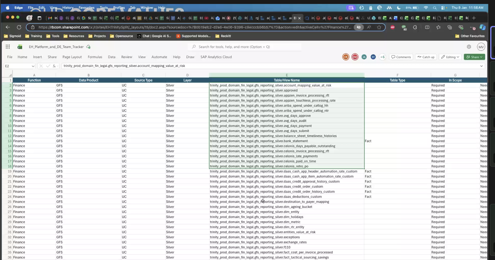
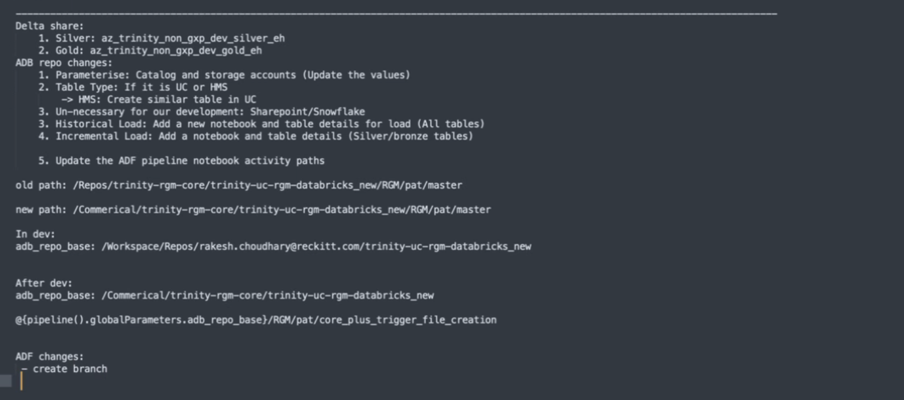

## Day1(5/01/26)

- assigned work on erb360
- done analysis on the pipeline level
- figured out the 12 pipelines and their flow
- [text](https://docs.google.com/spreadsheets/d/1j2PdUZckI85oShCMn4iWMU5ohoEiqOMB75ylQDB_egY/edit?usp=sharing)

- 

## Day2(6/01/26)
- looking on lineage paert of erb360
- on pipeline 

### `AMC_weekly_silver_master`

#### AMC_Report_silver with id

- **catalog**: trinity_dev_domain_mkt_erb (prod /dev)
- **tables**:
- `using`
{catalog_name}.ecomm_amc_bronze.amc_ltv_asin_data_new
{catalog_name}.ecomm_amc_bronze.amc_ltv_audience_01_data_new
{catalog_name}.ecomm_amc_bronze.amc_ltv_campaign_data_new
{catalog_name}.ecomm_amc_bronze.amc_ltv_campaign_no_userid_data_new

{catalog_name}.ecomm_dim_gold.dim_date

- `producing`
{catalog_name}.ecomm_amc_silver.amc_ltv_asin_data_with_id
{catalog_name}.ecomm_amc_silver.amc_ltv_asin_no_userid_data
{catalog_name}.ecomm_amc_silver.amc_ltv_campaign_data_with_id
{catalog_name}.ecomm_amc_silver.amc_ltv_campaign_no_userid_data
{catalog_name}.ecomm_amc_silver.amc_ltv_audience_01_data_with_id
{catalog_name}.ecomm_amc_silver.amc_advertiser_id_mapping

> {catalog_name}.ecomm_amc_silver.amc_ltv_asin_data_with_id. :  {catalog_name}.ecomm_amc_bronze.amc_ltv_asin_data_new + (`left join`) + {catalog_name}.ecomm_dim_gold.dim_date

>{catalog_name}.ecomm_amc_silver.amc_ltv_asin_no_userid_data: {catalog_name}.ecomm_amc_bronze.amc_ltv_asin_no_userid_data_new +(`left join`) +{catalog_name}.ecomm_dim_gold.dim_date

>{catalog_name}.ecomm_amc_silver.amc_ltv_campaign_data_with_id: {catalog_name}.ecomm_amc_bronze.amc_ltv_campaign_data_new + (`left join`) + {catalog_name}.ecomm_dim_gold.dim_date

>{catalog_name}.ecomm_amc_silver.amc_ltv_campaign_no_userid_data : {catalog_name}.ecomm_amc_bronze.amc_ltv_campaign_no_userid_data_new +(`left join`) + {catalog_name}.ecomm_dim_gold.dim_date

>{catalog_name}.ecomm_amc_silver.amc_ltv_audience_01_data_with_id : {catalog_name}.ecomm_amc_bronze.amc_ltv_audience_01_data_new + (`left join`) +{catalog_name}.ecomm_dim_gold.dim_date

>at last after join some of the dfs the are gettin a table {catalog_name}.ecomm_amc_silver.amc_advertiser_id_mapping
- trinity_prod_domain_mkt_erb.ecomm_amc_bronze.amc_ltv_asin_data_new
- trinity_prod_domain_mkt_erb.ecomm_amc_bronze.amc_ltv_asin_no_userid_data_new
- 

#### AMC_Report_silver without id

- `using`
{catalog_name}.ecomm_amc_bronze.amc_ltv_overlap_adproduct_data
{catalog_name}.ecomm_amc_bronze.amc_ltv_p2c_adproduct_data
{catalog_name}.ecomm_amc_bronze.amc_ltv_p2c_channel_data
{catalog_name}.ecomm_amc_bronze.amc_ltv_overlap_channel_data
{catalog_name}.ecomm_amc_bronze.amc_ltv_campaign_channel_data_new

{catalog_name}.ecomm_dim_gold.dim_date

- `producing`
{catalog_name}.ecomm_amc_silver.amc_ltv_overlap_adproduct_data_new
{catalog_name}.ecomm_amc_silver.amc_ltv_p2c_adproduct_data_new
{catalog_name}.ecomm_amc_silver.amc_ltv_p2c_channel_data_new
{catalog_name}.ecomm_amc_silver.amc_ltv_overlap_channel_data_new
{catalog_name}.ecomm_amc_silver.amc_ltv_campaign_channel_data_new

### `AMC_weekly_gold_master`

#### AMC_Gold

- `using`
{catalog_name}.ecomm_amc_silver.amc_ltv_asin_data_with_id
{catalog_name}.ecomm_amc_silver.amc_ltv_audience_01_data_with_id
{catalog_name}.ecomm_amc_silver.amc_ltv_audience_01_data_with_id
{catalog_name}.ecomm_amc_silver.amc_ltv_overlap_adproduct_data_new
{catalog_name}.ecomm_amc_silver.amc_ltv_p2c_adproduct_data_new
{catalog_name}.ecomm_amc_silver.amc_ltv_p2c_channel_data_new
{catalog_name}.ecomm_amc_silver.amc_ltv_overlap_channel_data_new

- `producing`

- how we can idently all the fact table, where the eh split need to be applied 
- adf pipeine which part is not requitred
- 

doubts:

1. no path has mentioned in 13 G,
2. do i need

## Day3(7/01/26)

### doubts:
1. do i need to write each of the gold tables seperatly, amc new have around <>
2. in the goldlayer file they are saving as 3 gold tables<>
- for general gold, rc and eh <>
- i have written only general, they are directly copying the general one to rc and eh<>

3. 261 line in gold layer the it is taking the data from bronze layer <>
4. i have written eh and rc tables and general tables in common it path will also vary accordingly<>
5. in the pipeline page from 9 onwards need to add eh and rc<>
6. should i need to update for each row for eh and rc<>
7. how i can identify which fact table from the silver layer data<>

- check in the dev eh catalog

### points: 
in the EPOS line number 533 contain the the are segre

- rows from 58-87 need to updated (that not finalized one)
- fresh doing from 88 onwards

### work done today:
completly analyzed the 
- amc_weekly_silver_master
- amc_weekly_gold_master
- epos_weekly_gold_master

figure outed all the table lineage and depedency tables
last two pipelines
- PL_ERB_SUPPLY_OLA_GOLD
- PL_ERB_controltower_GOLD
doesnt have any notebooks

## Day4(8/01/2026)

### doubts:
1. how we can identify the fact and dim tables from the silver layer
2. how we appplying the logic of trasfer of dim and fact from rc to eh(via delta share)
are we creating any tables for dim also
3. are we dealing with any stream data then how we will figure it out
4. what is the main purpose of the lineage tables , there are almost 200 + tables we analyzed
5. what if the any of the table we missed or written wrongly in the sheet
6. saw one column where `company_name` which using for eh and rc segregation

- identifying the incremental data
- find out the EH views

> yogesh doubts:
- how we identify the tables as fact or dim
- in your tracker sheet i have seen many tablels but the lineage part i cant able to fi=gure it out these much tables in sustainability
- what is your approach to indentify the adf level changes
- how 

#### AMC silver tables:
Based on the comparison between the two lists provided, here are the items from the first list that are **not** included in the second list:

1. **`trinity_prod_domain_mkt_erb.ecomm_amc_silver.amc_advertiser_id_mapping`**
* This table is present in the first text block but is completely missing from the second list.

amc_Itv_campaign_no_userid_data_new_backup
amc_Itv_campaign_no_userid_data_new_check

doubts:
2. in the sheet you have given contain 10 gold tables which all present in the lineage of mine , but some of the tables from my lineage is missing so do i need to take care on that?

3. what we do with the bronze csv file in the 5the row of lineage file
and the producing gold table is being using the formation of another gold table
`trinity_prod_domain_mkt_erb.ecomm_amc_gold.auinoutput`
- idea: this table is being used by many other tables, can we create this prior

### notes:
came to know that dim_product contain a column named company that we can used for join
1. dim_prodcut: company
>
spark.sql(f"""SELECT a.* FROM {catalog_name}.ecomm_amc_gold.FACT_Aioa_Cltv_V4_Campaign_Channel_new AS a
LEFT JOIN (select distinct Brand_ID,company from {catalog_name}.ecomm_dim_gold.dim_product) AS b
  ON a.Brand_Id = b.Brand_ID
WHERE b.Company in ('Essential Home')""").write.format('delta') \
>
>
spark.sql(f"""SELECT a.* FROM {catalog_name}.ecomm_amc_gold.FACT_aioa_cltv_v4_asin_no_userid AS a
LEFT JOIN {catalog_name}.ecomm_dim_gold.dim_product AS b
  ON a.Product_ID = b.Product_ID 
WHERE b.Company in ('Essential Home')""").write.format('delta') \
>
2. the fact table join column need not be unique
3. 

## Day5(9/01/2026):

### doubts:
1. what is latam , euanz and all<>
2. in the erb assesment sheet (81,k) some of the tables are using to produce some of the other gold tables so do we need to include those(ig not)<>
3. apart from the that external csv file everything is sorted out<>
4. have to indetify other than ecomm_dim_gold.Dim_Retailer_Product in epos for split logic<>
5. what is the use of the tables sheet in the assessment<>
6. what is the use of config in databricks delta share<>

### pipeline level changes:
- in AMC_weekly_silver_master two notebook we can remove 

## day6

- done the tracker sheet update work
- added the distinct logic the with the tables
- reviewed for the epos, all tables gettinf mismatch 

## day7 (12/01/2026):
- trinity_prod_domain_sales.pos_gold.v_fact_sellout , need to load from external place
- all epos fact table are getting an issue of product id mismatch like 
in fact table it is like : 6715363
in dim table: 1142172

- in epos 109 found thet ecomm_dim_gold.Dim_Retailer_Store is using for the production of the ecomm_dim_gold.Dim_Retailer_Store it self.

- what we do for the table trinity_prod_domain_mkt_erb.ecomm_retail_sales_silver.Fact_Sell_Out_Daily_EUANZ, and (line 50 ,51) these is not spliting happening
- in the last two pipelines they are calling the datbaricks jobs via passing params on the adf?  where i can get the params
- global param is not defined in the manage tab
- when i analyed the 
erb_supply_ola_gold
erb_controltower_gold
both have connection to the e630 pathfinders folder where they producing some tables
- 

### todo:
- trinity_prod_domain_sales.pos_gold.v_fact_sellout. 
have to identify the eh_plsoit logic
- ask dhanraj to how the reckit process is happening once i got the cred
- have to contact anurag for the full process of how to do the incremental load and other things
- have to schedule a call with amurtha today and rectify what to do with the other pipelines
- have to identify the incremental loading
- here we had only few pipelines so how to run these all pipelines, and how to x`

## day8(13/01/2026)

### what to say
- start with the sheet updated 
- shared and explain we found the logic of all these
- there some fact tables where the logic is fine but we cannt prove it because of the syncing issue with the prod and dev ig
- i can say about the 
- understaing  the last two pipelines
- updated the pipeline level changes we need to perform
- 

fact_controltower_country
fact_controltower_brand

#### todo night:
- list it out the prodcut name in the sheet correctly
- 

## day9(15/01/2026)

- in  the fact_analysis table each lett id is associated with only one bussiness uniot only
- we need to check the bussiness unit is really part of any of the rc or essen., health, nutrion
- access on the resources 
- trinity_prod_domain_sales.pos_gold.v_fact_sellout want to check do we need to any split logic in here, it is already a fact 
a table in gold layer 
- table v_fact_sellout included in the pos gold layer do i need to review it
- 

### pending tables:
- trinity_prod_domain_mkt_erb.ecomm_supply_dataimpacts_silver.fact_oos_day
- trinity_prod_domain_mkt_erb.ecomm_supply_estore_silver.fact_one_view
- trinity_prod_domain_sales.pos_gold.v_fact_sellout
- {adls_bronze}/AMC/reckitt_output.csv
- trinity_prod_domain_mkt_erb.ecomm_retail_sales_silver.Fact_Sell_Out_Daily_EUANZ
- trinity_prod_domain_mkt_erb.ecomm_retail_sales_silver.Fact_Sell_Out_Daily_LATAM

## Day10:(16/01/2026)
- storage accnt names, and authentication in adf 
- update the epic , upload the sheets in there

### todo:
1. copy the assement data into the sharesheet they provided
2. complete the /supply/ola analysis
3. ask yash to verify on the controltower is there any silver data contain
4. verify data from pbi team
5. find out the incremental logic for all the fact tables
6. arrange the files in my system
7. do the complete code for history load
8. after analysis of ola give the sheet to verify to amrutha 
9. watch rakesh video once more
10. arrnage all the sheets to one system